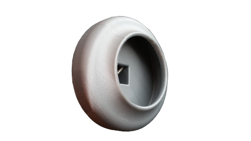

===========
Accessories
===========

Suction Cup Dildo Adapter
-------------------------

This is the files to print the Suction Cup Dildos Adapter. It is made
of two parts: one is the above and the under part. With a screw it is
clamped on a aluminium scare tube of size 15mm. 

STL file -> |SuctionCupAdapterSTL|

.. |SuctionCupAdapterSTL| raw:: html

  <a href="https://www.thingiverse.com/thing:5180478/files"
  target="_blank">Suction Cup Adapter STL</a>
  

Vac u Lock Adapter
------------------

Silicon Mold
^^^^^^^^^^^^

Listing Parts
'''''''''''''
1) Cup
2) Centerign Cover
3) Threaded Stem
4) Aluminium Vac u Lock Model   

Operation Plan
''''''''''''''
	 
1) Prepare 220g silicon and 11g hardener
2) Stir 5min
3) Put a tape border on the plastic cup    
4) Wait 20min to remove the bubles
5) Fill in through one of the hole
   
Mold the Adapter
^^^^^^^^^^^^^^^^

1) Use a 50mm long M6 bolt
2) Prepare 20g cast and 20g hardener
3) Stir really slowly   

