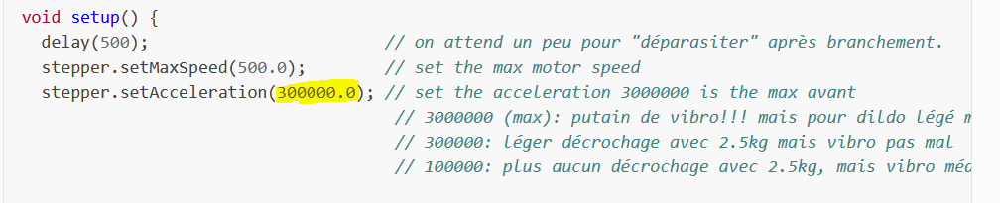
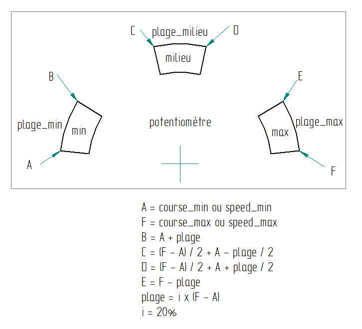

====
Code
====

  .. |CodeArduino| raw:: html

    <a href="https://github.com/lm42p/diy/blob/master/docs/source/Code/"
    target="_blank">Code Arduio</a>

Here is the Arduino code. You can download the latest and the previous
versions from here : |CodeArduino|. 
I'm not a professional programmer. The code is a bit
messy/dirty sorry about that. At the begining I tried to use AccelStepper
library for Arduino but couldn't get it work well. (couldn't reach an
appropriate speeed I don't know why) so I remove AccelStepper library
and tried to do something and it worked not badly. The code are named:
**CodeGeckoVx.ino**. But after that a few person ask me to remove the
jump of speed at 90% of the speed knob and to improve the moves when
heavy dildos are used at around 2kg, I made another version using the
library accelStepper. The speed isn't so high as the original one
(CodeGeckoVx.ino) but it afford more reliability when the move change
direction (espacielly with big loads). That code is called
**CodeGeckoAccelStepVx.ino**. Find the latest code underneath. Sorry
the comments in the code are in french, I'll translate them soon! Thanks.

Maybe this video can help to understand the code

.. raw:: html

    <iframe width="350" height="245"
    src="https://www.youtube.com/embed/VgY4AlmjkgQ"
    frameborder="0" 
    allowfullscreen></iframe>

CodeGeckoV5.ino
---------------

.. literalinclude:: /Code/CodeGeckoV5.ino
   :language: c

CodeGeckoAccelStepVx.ino
------------------------

.. note::

   For a better vibro you can adjust that parameter
   **stepper.setAcceleration(....)**: 

  * 3000000 is the fastest acceleration for a strong vibro but for light
    dildo ;
  * 300000 for up to 2kg dildo ;
  * 100000 for heavier dildos.

    

	    

.. literalinclude:: /Code/CodeGeckoAccelStepV1.ino
   :language: c	      

Figure
^^^^^^

This figure helps to understand how the area on remote are defined.

	      
Updates
-------

CodeGeckoVx.ino:
''''''''''''''''

V3 -> V4 : In the V3 when the RJ45 (Remote Control) is pull out
during full speed, the stroke goes to its max, this could be
dangerous. V4 avoid this and a reset is necessarily when it
happens. Also V4 doesn't permit a too much high gradient of stroke
change.

V4->V5 : V4->V5 stroke_min has been set to 296 instead of 380 allows
maybe to have a better vibro 

CodeGeckoAccelStepVx.ino
''''''''''''''''''''''''

V1: first version

How to update the Latest Firmware
---------------------------------

This video helps to understand how to update Firmware :

.. raw:: html

    <iframe width="350" height="245"
    src="https://youtube.com/embed/uF3yKtnd0LE"
    frameborder="0" 
    allowfullscreen></iframe>

#. Download and install Arduino IDE software
#. Connect LM42P with a usb cable
#. Open Arduino IDE
#. File  New
#. Delete what is in the file
#. Copy / paste the latest code from LM42P site
#. Click compile button there should be no error
#. Click upload button 

.. note::

   If there is a error during uploading then you should try to select
   the good Port. Go to Tools -> Ports If Ports is grey then try to
   put another arduino the port should not be grey. Then put the
   arduino you wanted to update.
