.. # define a hard line break for HTML
.. |br| raw:: html

  

=================
 Electrical Part
=================

	    
Electrical Box
==============

.. note::

   There is another Electrical Box which is about 130$ cheaper but
   15-20% slower and 40% less powerful (instead of 29 lbs thrust 17
   lbs) The Box is 3D printed. 

    .. image:: figures/CheapElectricalBox/Cheap_Electrical_Box-DIY-LM42P.JPG
      :width: 300
      :align: center
   
   
   Driver : |CheapDriverAliexpress|

   .. |CheapDriverAliexpress| raw:: html

     <a href="https://www.aliexpress.com/item/32659074865.html?spm=a2g0s.9042311.0.0.27424c4dLziSPX"
     target="_blank">Cheap Driver Aliexpress</a>

   .. image:: figures/CheapElectricalBox/Cheap_Driver-Cheap-Electrical-Box-DIY-LM42P.JPG
      :width: 300
      :align: center
	      
   
   Power 24V, 6A : |Power24V6AAliexpress|

   .. |Power24V6AAliexpress| raw:: html

     <a href="https://www.aliexpress.com/item/32589666765.html?spm=a2g0s.9042311.0.0.27424c4dOakSKw"
     target="_blank">Power 24V 6A Aliexpress</a>
     
   .. image:: figures/CheapElectricalBox/Cheap_Power_24V_6A-Cheap-Electrical-Box-DIY-LM42P.JPG
      :width: 300
      :align: center
	      
   
Listing Parts
-------------

U Base
~~~~~~
- Quantity : 1x
- Material : anodized aluminium

U Top
~~~~~
- Quantity : 1x
- Material : anodized aluminium

U Right
~~~~~~~
- Quantity : 1x
- Material : anodized aluminium

U Left
~~~~~~
- Quantity : 1x
- Material : anodized aluminium

	    
Geckodrive G201X
~~~~~~~~~~~~~~~~
- Quantity : 1x

.. image:: figures/Geckodrive_G201X-Electrical-Box-DIY-LM42P.jpg
    :width: 350
    :align: center

Arduino Uno
~~~~~~~~~~~
- Quantity : 1x
  
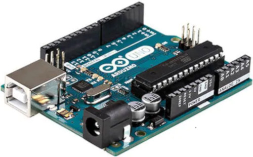
       

Power 36V
~~~~~~~~~
- Quantity : 1x
  
.. image:: figures/Power_36V-Electrical-Box-DIY-LM2P.jpg
    :width: 450
    :align: center

	    
Power 36/12V
~~~~~~~~~~~~
- Quantity : 1x
- Type : LM2596

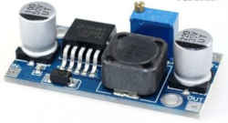

	    
Connector Socket 5 pins Female Insert
~~~~~~~~~~~~~~~~~~~~~~~~~~~~~~~~~~~~~
- Quantity : 1x
  
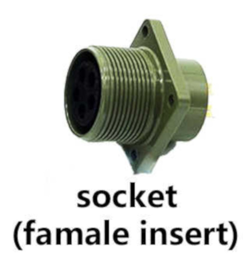

Plug RJ45
~~~~~~~~~
- Quantity : 1x
- Include : 2x screw M3, 2x nuts M3 and 2x spring washer
  

Cable Gland
~~~~~~~~~~~
- Quantity : 1x
- Type : M16 4.5-10mm
- Include : 1x nuts M16  

Cable Ties
~~~~~~~~~~

- Quantity : 1x
- Purpose : To be sur that the **Cable Silicone 3 cores** can't be
  pull out

Cable Silicone 3 Cores
~~~~~~~~~~~~~~~~~~~~~~
- Length : 1x 2m
- Type : 0.75mm^2 
- Note : I used silicone because it's easy to fold.  
	    

	    
Plug 110 / 220 V
~~~~~~~~~~~~~~~~

	    
Male PCB PIN Header
~~~~~~~~~~~~~~~~~~~
- 1x 15 pins
- 1x 10 pins
- 1x 8 pins

Connector RJ45
~~~~~~~~~~~~~~
- Quantity : 1x
- Length : 15cm  

Ground Terminal M3
~~~~~~~~~~~~~~~~~~
- Quantity : 1x

	    
Capacitor Polarized 1uF
~~~~~~~~~~~~~~~~~~~~~~~
- Quantity : 1x
- Purpose : This reduce the noise while reading the speed on the
  remote-control

Spacer 6-8-3mm
~~~~~~~~~~~~~~
- Quantity : 4x
- Material : aluminium

	    
Square 10-12-9mm
~~~~~~~~~~~~~~~~
- Quantity : 2x
- Material : aluminium
- Purpose : Reinforcement of the fixaton (glue) of the **Arduino Uno**
  to the **U Base**   

	    
Countersunk Head Screw M3 x 8mm
~~~~~~~~~~~~~~~~~~~~~~~~~~~~~~~
- Quantity : 4x
- Material : Stainless Steel
- Purpose : To fix **Geckodrive** on the **U Base**
  

	    
Countersunk Head Screw M3 x 12mm
~~~~~~~~~~~~~~~~~~~~~~~~~~~~~~~~
- Quantity : 4x
- Material : Stainless Steel
- Purpose : To fix the **Connector Socket 5 pins Female Insert** on
  the **U Right** 
  

	    
Countersunk Head Screw M3 x 14mm
~~~~~~~~~~~~~~~~~~~~~~~~~~~~~~~~
- Quantity : 3x
- Material : Stainless Steel
- Purpose : To fix the **Power 36V** on the **U Base**  

Countersunk Head Screw M3 x 16mm
~~~~~~~~~~~~~~~~~~~~~~~~~~~~~~~~
- Quantity : 1x
- Material : Stainless Steel
- Purpose : To fix the **Power 36V** also the **Ground Terminal** on
  the **U Base**  

.. image:: figures/Countersunk_Head_Screw_M3x16mm-DIY-LM42P.PNG
    :width: 350
    :align: center

Washer M3
~~~~~~~~~
- Quantity : 12x

Nuts M3
~~~~~~~
- Quantity : 12x

Rivet
~~~~~
- Quantity : 14x
- Type : diameter 3mm, length 6mm  
- Material : Stainless Steel

	    
Glue Silicone
~~~~~~~~~~~~~
- Quantity : 1x
- Type : Polyflex 444
- Purpose : To glue the **Arduino Uno** to the **U Base** using the
  **Square 10-12-9mm** to fix stronger
  

Threadlocker Glue
~~~~~~~~~~~~~~~~~
- Quantity : 1x
- Type : Loctite 243
- Purpose : To glue the **Nuts M3**
  

       
Operation Plan
--------------

Make The Sheets Parts
~~~~~~~~~~~~~~~~~~~~~

	    
Make the **U Base**, **U Right** and the **U Left** following this
**Video**, see also the drawings below : 

.. raw:: html

    <iframe width="350" height="245"
    src="https://www.youtube.com/embed/RGeVY6nWUIQ?start=0&end=1078"
    frameborder="0" 
    allowfullscreen></iframe>

|br|

**Drawings** :

Material : aluminium

    U Base

    U Top

.. figure:: figures/U_Right-Drawing-Electrical-Box-DIY-LM42P.PNG
    :width: 500
    :align: center

    U Right

    U Left   

Make the Spacer 6-8-3mm
~~~~~~~~~~~~~~~~~~~~~~~
See the following video :

.. raw:: html

    <iframe width="350" height="245"
    src="https://www.youtube.com/embed/RGeVY6nWUIQ?start=1025&end=1275"
    frameborder="0" 
    allowfullscreen></iframe>

|br|

**Drawing** :

- Quantity : 4x
- Material : aluminium

    Spacer 6-8-3mm

Make the Square 10-12-9mm
~~~~~~~~~~~~~~~~~~~~~~~~~
See the following video :

.. raw:: html

    <iframe width="350" height="245"
    src="https://www.youtube.com/embed/RGeVY6nWUIQ?start=1276&end=1356"
    frameborder="0" 
    allowfullscreen></iframe>

|br|

**Drawing** :

- Quantity : 2x
- Material : aluminium

    Square 10-12-9mm        

Scrape the surface on the U Base
~~~~~~~~~~~~~~~~~~~~~~~~~~~~~~~~

File the bottom of the **U Base** (only the part where the red framed
hole is) so that the grounding contact faces well. This operation is
not necessary if you are using non anodized sheets.

.. note:: The anodized surfaces are not
	  conductive.  

See Video :

.. raw:: html

    <iframe width="350" height="245"
    src="https://www.youtube.com/embed/RGeVY6nWUIQ?start=152&end=173"
    frameborder="0" 
    allowfullscreen></iframe>

|br|

Control Power 36V
~~~~~~~~~~~~~~~~~
Control the voltage of the output of the Power 36V with a
voltmeter. It should be 36V.

Adjust voltage Power 36/12V
~~~~~~~~~~~~~~~~~~~~~~~~~~~

**Materials:**

* 1 wire 0.5mm^2 red length = 120mm
* 1 wire 0.5mm^2 red length = 150mm
* 1 wire 0.5mm^2 black length = 140mm
* 1 wire 0.5mm^2 black length = 60mm

1) Sold the wire

.. image:: figures/Power36_12V-Red-Wired-Electrical-Box-LM42P.PNG
    :width: 500
    :align: center

2) Wire the Power 36/12V

 - Connect the Power 36/12V IN  to the Power 36V OUT
 - Connect the voltmeter to Power 36/12V OUT

3) Adjust the voltage

 With a *Screwdriver 0*, adjust the voltage to 12V
   
   
Fix the Power Cable to the Electrical Box
~~~~~~~~~~~~~~~~~~~~~~~~~~~~~~~~~~~~~~~~~

See Video :

.. raw:: html

    <iframe width="350" height="245"
    src="https://www.youtube.com/embed/RGeVY6nWUIQ?start=1355&end=1581"
    frameborder="0" 
    allowfullscreen></iframe>

#. Strip the **Cable Silicone 3 Cores** at 10cm 
#. Fix the **Cable Gland** to the **U Base**
#. Tighten **Cable Gland**
#. Tighten the **Cable Ties** and cut it with a *Cutting Pliers*
#. Tighten the **Ground Terminal M3** on the ground wire (yellow)
#. Tighten the Phase and Neutre to **Power 36V** "IN"

Set Geckodrive current limit
~~~~~~~~~~~~~~~~~~~~~~~~~~~~

- For G203V :

  Connect a resistor of 120kOhms between pin 11 and 12 of the 
  GECKODRIVE. This will limit MOTOR current by 5A.

- For G201X :

  set the switches like the following figure

  .. image:: figures/Switch_5A_G201X-Electrical-Box-DIY-LM42P.png
  	:scale: 70 %
 	:align: center
		
   
Screw the Power 36V and Geckodrive on the U Base
~~~~~~~~~~~~~~~~~~~~~~~~~~~~~~~~~~~~~~~~~~~~~~~~

.. note:: Use **Threadlocker Glue**.

- For Power 36V :
  
  #. Fix three corners of the **Power 36V** by using :
       * 3x **Spacer 6-8-3mm**
       * 3x **Countersunk Head Screw M3 x 14mm**
       * 3x **Washer M3**
       * 3x **Nuts M3**
  #. Fix the last corner : The ground to the U Base by using : 
       * 1x **Countersunk Head Screw M3 x 16mm**
       * 1x **Washer M3**
       * 1x **Nuts M3**
       * 1x **Ground Terminal M3** (the ground on the **Cable Silicone 3
         Cores** 

    =========  ===================    
    Power 36V  U Base
    =========  ===================
    GROUND     screw with *Spacer*
    =========  ===================

    .. image:: figures/Power36V_Ground_Electrical-Box-DIY-LM42P.jpg
  	:width: 500
 	:align: center
  
- For Geckodrive use :

  - 4x **Head Screw M3 x 8mm**
  - 4x **Washer M3**
  - 4x **Nuts M3**

Glue the Power 36/12V and Arduino Uno
~~~~~~~~~~~~~~~~~~~~~~~~~~~~~~~~~~~~~

Glue the **Arduino Uno** at the **U Base** with **Glue Silicone** and
**Square 10-12-9mm** and the **Power 36/12V**. 
 

Wiring
~~~~~~
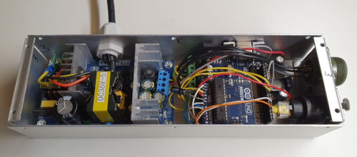

.. image:: figures/Shagmatic-Arduino-Gecko-LM42P.JPG
    :width: 500
    :align: center

	    
See video :

.. raw:: html

    <iframe width="350" height="245"
    src="https://www.youtube.com/embed/RGeVY6nWUIQ?start=1581&end=1806"  
    frameborder="0" 
    allowfullscreen></iframe>
    
|br|

1. Sold the wires to the **Male PCB PIN Header** (15, 10, 8 pins),
   except the POWER 36/12V OUT+ 

   Use two clamps this help to sold the **Male PCB PIN Header**

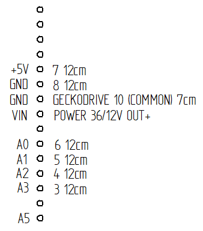

 Male PCB PIN Header 15 pins
	 

 Male PCB PIN Header 10 and 8 pins
	 
===========  =======  ============
GECKODRIVE   ARDUINO  Cable Length
===========  =======  ============
8 (DIR)      PIN 8    11cm
9 (STEP)     PIN 9    11cm
10 (COMMON)  GND       7cm
===========  =======  ============

============  =======  ============
POWER 36/12V  ARDUINO  Cable Length
============  =======  ============
OUT-          GND      6cm
OUT+          VIN      12cm
============  =======  ============

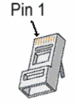

============  =======================  ============
ARDUINO       RJ45 cable (inside Box)  Cable Length
============  =======================  ============
A0            6 sold capacitor +       12cm     
A1            5                          "
A2            4                          "
A3            3                          "
\~3           2                        15cm 
~5            1                          " 
GND           8 sold capacitor -       12cm
\+5V          7                          "
============  =======================  ============

2. Sold the Capacitor between A0 and GND (8) see folowing picture

3. Connect :

=========  ================  ============
Power 36V     GECKODRIVE     Cable Length
=========  ================  ============
\-DC       1 (POWER GND)     6cm
D+         2 (18 TO 80 VDC)   "
=========  ================  ============

=========  ============  ============
Power 36V  POWER 36/12V  Cable Length            
=========  ============  ============
\-DC       IN-           14cm 
DC+        IN+           15cm  
=========  ============  ============

=================  ========================  ============
GECKODRIVE         Female Connector (MOTOR)  Cable Length
=================  ========================  ============
3 (WINDING A)      A                         15cm
4 (WINDING not A)  B                          "
5 (WINDING B)      C                          "
6 (WINDING not B)  D                          "
=================  ========================  ============

Upload the programm to **Arduino Uno** and final control
~~~~~~~~~~~~~~~~~~~~~~~~~~~~~~~~~~~~~~~~~~~~~~~~~~~~~~~~
#. Plug the PC using an USB cable to the Electrical-Box
#. Upload the programm (soon available)
#. Control if every thing is ok (the ***Machine**, **Remote Control**,
   **Stepper Motor** and the **Rod** should be done). Do all these
   steps showed in that video for the test :  

   .. raw:: html

    <iframe width="350" height="245"
    src="https://www.youtube.com/embed/VgY4AlmjkgQ"
    frameborder="0" 
    allowfullscreen></iframe>
#. Cover with **U Top** and **Rivet**
    
Remote Control
==============

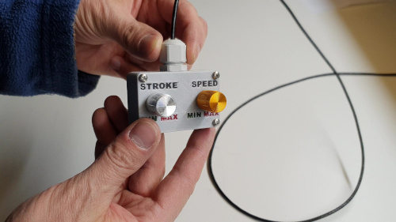

Listing Parts
-------------

Box
~~~
- Quantity : 1x
- 3D Printed in PLA  

Cover
~~~~~
- Quantity : 1x
- 3D Printed in PLA  

Potentiometer
~~~~~~~~~~~~~
- Quantity : 2x
- Type : 10k

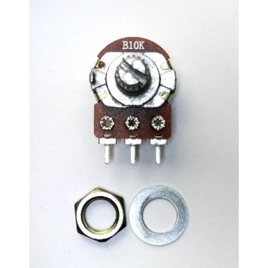
	    
Potentiommeter Knobs
~~~~~~~~~~~~~~~~~~~~
- Quantity : 1x Grey (stroke), 1x Gold (speed)
  

RJ45 Cable
~~~~~~~~~~
- Quantity : 1x
- Length : 2.5m  
- Type : Ultrafine

	    	    
Cable Gland M12
~~~~~~~~~~~~~~~
- Quantity : 1x
- Type : M12 3-6mm

Epoxy
~~~~~
- Resin and Hardener

.. image:: figures/Remote-Control/Epoxy_Resin-Remote-Control-Box-DIY-LM42P.JPG
    :width: 200
    :align: center
  
	    
Pigment Epoxy
~~~~~~~~~~~~~
- Quantity : 1x color black, 1x color red, 1x color green

Cable Ties
~~~~~~~~~~

- Quantity : 1x
- Purpose : To be sur that the **RJ45 Cable** can't be
  pull out

.. image:: figures/Remote-Control/Cable_Ties-Remote-Control-Box-DIY-LM42P.jpg
    :width: 170
    :align: center	    

Screw
~~~~~
- Quantity : 4x
- Diameter : 2.9mm
- Length : 13mm
- Stainless steel

	    

Operation Plan
--------------
See the video :

.. raw:: html

    <iframe width="350" height="245"
    src="https://www.youtube.com/embed/wxmEBM34qhU"
    frameborder="0" 
    allowfullscreen></iframe>

|br|

Make the Box
~~~~~~~~~~~~
Print it in PLA.
Infill = 50%
File : soon available...

Make the Cover
~~~~~~~~~~~~~~
1. Print it in PLA.
   Infill = 50%
   File : soon available...  
2. Prepare the **Epoxy** with black pigment, red pigment and green
   pigment 
3. Fill with pigmented Epoxy the inscriptions on the **Cover**

     .. image:: figures/Remote-Control/Fill_Inscriptions_Pigmented_Epoxy-Remote-Control-Box-DIY-LM42P.JPG  
       :width: 250
       :align: center
	   
4. Cure the **Epoxy** then sand it very thin (60, 240, 400)
5. Place the **Potentiometer** (2x) and and tighten them   

Wiring the Remote Control
~~~~~~~~~~~~~~~~~~~~~~~~~

.. image:: figures/Remote-Control/Remote_Control_Box_Wiring-Remote-Control-Box-DIY-LM42P.png
   :scale: 70 %
   :align: center

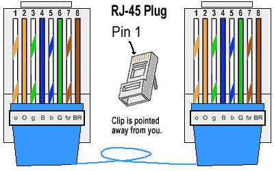
	   
==============  ===========  ============
Remote-Control   RJ45 cable   Wire Color
==============  ===========  ============
A0              6            G
A1              5            b
GND             8            BR
\+5V            7            br
==============  ===========  ============

#. Strip the **RJ45 Cable** at 7cm
#. Cut the unused wire
#. Use the cutted unused wire to make the bridge between GRD and +5V
   inside the Remote Control

Motor
=====

This section shows how to fix the **Cable Silicone 4 Cores** to the **Connector
Plug 5 pins Male Insert** and the **Motor**

Listing Parts
-------------

Motor
~~~~~
- Quantity : 1x
- Type : Stepper Motor NEMA 23 23HS11240
- Length : 112mm
- 4.2A  

Connector Plug 5 pins Male Insert
~~~~~~~~~~~~~~~~~~~~~~~~~~~~~~~~~
- Quantity : 1x

Cable Silicone 4 Cores
~~~~~~~~~~~~~~~~~~~~~~
- Quantity : 2.2m
- 0.75 mm^2  

	    
Tube Cable Holder
~~~~~~~~~~~~~~~~~
- Quantity : 1x
- Material : Aluminium  

Heat Shrink Tube
~~~~~~~~~~~~~~~~
- Quantity : 4x - Length : 13mm
- Quantity : 1x - Length : 37mm

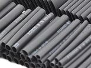
  
Screw Hex Head Allen M5 x 40
~~~~~~~~~~~~~~~~~~~~~~~~~~~~
If the **Motor** isn't fixed yet on the **Machine**, then 1x Screw is
needed.

- Quantity : 1x
- Size : M5 x 40  
- Type : Stainless Allen Bolt Socket Cap Screw Hex Head Allen Key
  DIN912 

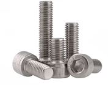
	    
Glue Silicone
~~~~~~~~~~~~~
- Quantity : 1x
- Type : Polyflex 444
  

Cable Ties
~~~~~~~~~~

- Quantity : 1x

.. image:: figures/Remote-Control/Cable_Ties-Remote-Control-Box-DIY-LM42P.jpg
    :width: 170
    :align: center	    	    

	    
Connect the Connector Plug 5 pins Male Insert
---------------------------------------------
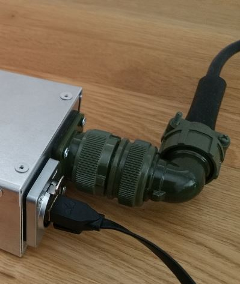

Operation Plan
~~~~~~~~~~~~~~
See the video :

.. raw:: html

    <iframe width="350" height="245"
    src="https://www.youtube.com/embed/GfWPj4LcxXg?start=0&end=97"
    frameborder="0" 
    allowfullscreen></iframe>

|br|

Wiring

#. strip the cable at 3cm
#. strip the 4 wires and solder the wires
#. 5cm from the edge roll up the 10-layers adhesive tape
#. pass the cable and solder the wires in the plug in
   counter-clockwise order 
   
   * black (A)
   * yellow (B)
   * red (C)
   * green (D)

   .. image:: figures/Motor/Wires_Plug-Motor-DIY-LM42P.png
    :width: 200
    :align: center
	    
#. assemble the plug and tighten the flange

Connect and fix the Cable Silicone 4 Cores to the Motor
-------------------------------------------------------
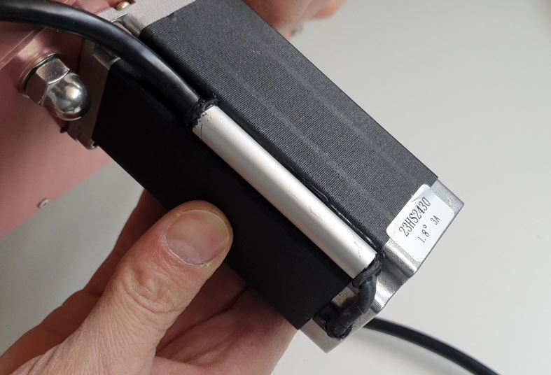

Operation Plan
~~~~~~~~~~~~~~
See the video :

.. raw:: html

    <iframe width="350" height="245"
    src="https://www.youtube.com/embed/GfWPj4LcxXg?start=97&end=417"
    frameborder="0" 
    allowfullscreen></iframe>

|br|	    

#. Make the **Tube Cable Holder**

   .. figure:: figures/Motor/Tube_Cable_Holder-Drawing-Motor-DIY-LM42P.PNG
     :width: 400
     :align: center	    

     Tube Cable Holder (material aluminium anodized)

#. Unpacking and motor control. Plug the 4 wires on an **Electrical
   Box** and make it turn. This is important before making the
   following steps.
#. There are two kinds of motor a 3A and a 4.2A each motor has their own
   colors of wire. Depend on the Amps of the motor you use, cut the
   wire as follow :
   
   #. Motor 3A :
      
      - red wire 47mm
      - yellow 57mm
      - blue 67mm
      - green 77mm
	
      .. figure:: figures/Motor/Cut_Motor_Wire-Motor-DIY-LM42P.jpg
        :width: 400
        :align: center

	3A motor with wires cutted 

   #. Motor 4.2A :
      
      - red 47mm
      - green 57mm
      - black 67mm
      -	blue 77mm
	
#. Stripping, twisting, tinning the motor wires to 5mm
#. Cut the **Heat Shrink Tube** to 37mm length and tighten it with
   industrial foehn. The red wire should protrude about 5mm..     
#. Cut the **Cable Silicone 4 Cores** at 2.2m
#. Strip the **Cable Silicone 4 Cores** to 45mm.
#. Cut the wires on the **Cable Silicone 4 Cores** as follow:
   - red 40mm
   - yellow 30mm
   - black 20mm
   - green 10mm
#. Strip, twist, tin-plate the cable wires to 5mm.
#. Cut 4x **Heat Shrink Tube** at 13mm
#. Put 13mm **Heat Shrink Tube** + **Tube Cable Holder** (pay
   attention to direction the chamfer 1x45) and solden
#. Degrease **Tube Cable Holder**, **Cable Silicone 4 Cores** and
   **Motor** with acetone 

   .. warning::
      
     If the **Motor** isn't fixed on the machine yet, then don't
     forget to put the screw in the motor hole (see picture below) 

#. Inject the **Glue Silicone** through the 4mm hole diam.
   until it comes out of both sides of the **Tube Cable Holder**; take
   the surplus and apply it to the **Motor** on the groove where the
   **Screw Hex Head Allen M5 x 40** has been placed; 
   turn the **Tube Cable Holder** so that the injection hole is
   against the **Motor** and is not visible; put a **Cable Ties** on
   the **Cable Silicone 4 Cores** , put the **Tube Cable Holder** on  
   with the clamp see following picture
   
   .. image:: figures/Motor/Fix_Motor_Cable-Motor-DIY-LM42P.jpg
     :width: 400
     :align: center
	    
   if necessary, inject at the end of the **Tube Cable Holder** where
   the chamfer is located and put some **Glue Silicone** on the
   **Motor** if you see the wires that protrude a little beyond the
   **Heat Shrink Tube** 
#. Allow to harden; clean and remove the beads on **Tube Cable
   Holder**. 

    

	    
