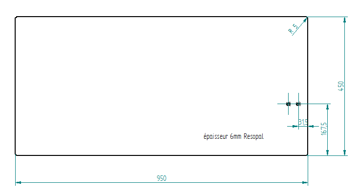

Fastening Elements
==================

Mast
----

Tools
^^^^^

- 

Building Plate
--------------

- Material : RESOPAL
- Thinkness : 6mm
- Size : 450 x 950 x 6 mm
- Weight : 4kg 
	  

Fastening bolt
--------------

.. image:: figures/Fastening-Bolt.png
  :scale: 80 %
  :align: center

1. Saw the bolt

2. Deburr the bolt

   
Silicone-Plate 60x40x3
----------------------

.. image:: figures/Silicone-Plate-60x40x3.png
  :scale: 60 %
  :align: center

1. Cut the plate with a cutter
2. Cut wiht a cookie cutter  the hole diameter 6mm     

   
Allen Cone Head Screw
---------------------

- Type : M8 x 45mm
- Supplier : Debrunner
- N° Article : 101 14 091

Allen Tightening Key
--------------------

- Type : 5mm
- Supplier : Debrunner
- N° Article : 811 305 240

  
  

  
   
