=======
Machine
=======

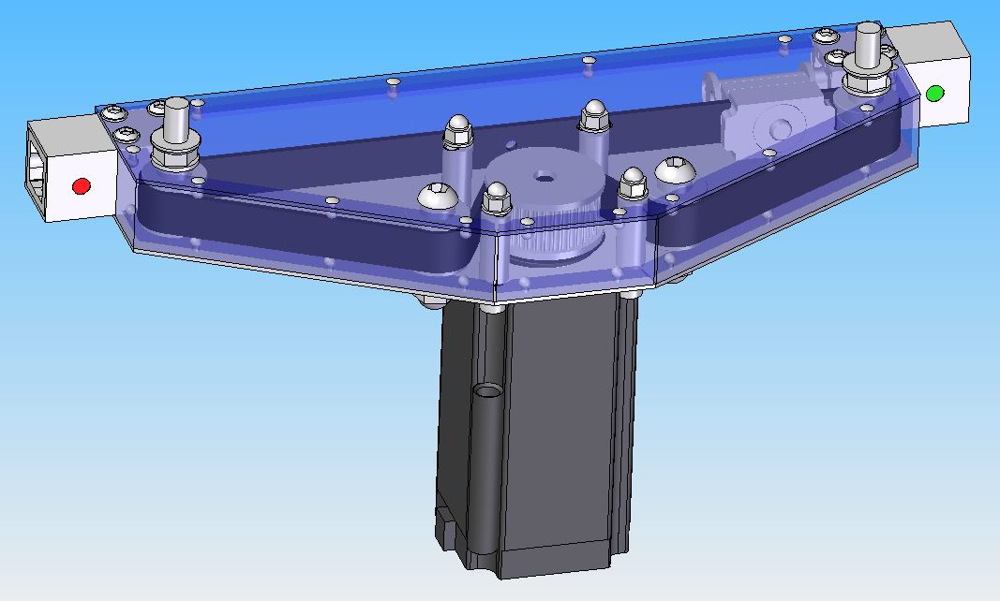
	    
Moving Parts
------------
Listing Parts
^^^^^^^^^^^^^
Motor
'''''
Quantity : 1x

Timing Pulley
'''''''''''''
- Quantity : 1x
- Type : HTD3M Type 40T
- Size : hole diameter = 8mm width =  16mm

  .. |TimingPulleyAliexpress| raw:: html

    <a href="https://www.aliexpress.com/item/32816074465.html?spm=a2g0s.9042311.0.0.27424c4dc8WrRN"
    target="_blank">Aliexpress</a>
  
- Where to buy : |TimingPulleyAliexpress|

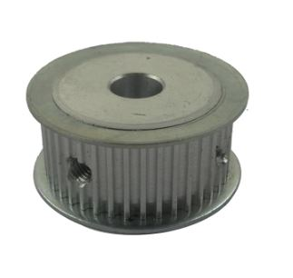

	    
Timing Belt
'''''''''''
Quantity : 1x

Idler Pulley Long Screw
'''''''''''''''''''''''
Quantity : 2x

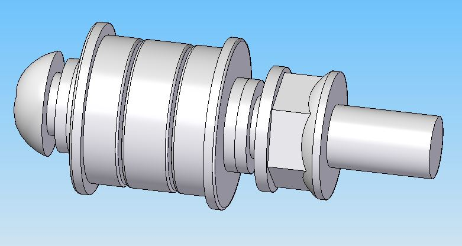

Idler Pulley Short Screw
''''''''''''''''''''''''
Quantity : 2x

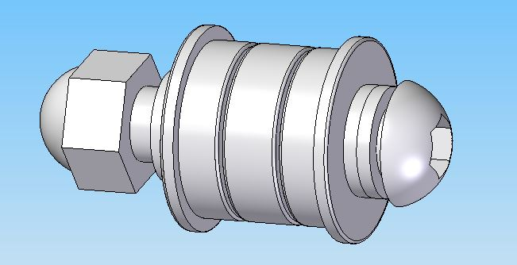

Belt Joint
''''''''''
Quantity : 1x

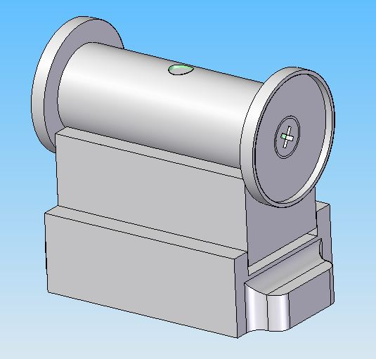

Rod
'''
Quantity : 1x or 2x

Idler Pulley Long Screw
^^^^^^^^^^^^^^^^^^^^^^^

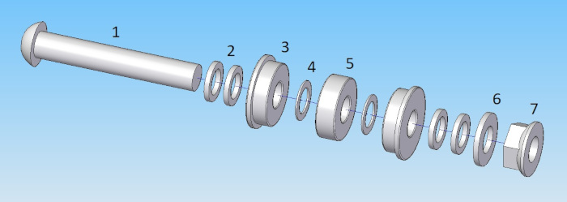

Listing Parts
'''''''''''''

1) Long Screw M8
  
  - Quantity : 1x
  - Length : 50mm  
  - Material : stainless
        
  .. image:: figures/Long_Screw-Machine-DIY-LM42P.JPG
    :width: 250
    :align: center
	    
2) Washer 8 x 12 x 1.5

  - Quantity : 4x
  - Material : aluminium
    
  .. image:: figures/Washer_8x12x1_5-Machine-DIY-LM42P.PNG
    :width: 300
    :align: center

.. note::
   
   Maybe better to use 1x Stainless steel Flat Washer Thickness 1mm 
   (8x14x1mm) and 1x Stainless steel Flat Washer 0.5mm
   (8x14x0.5). 1.5mm doesn't exist. Because aluminum tends to crush
   when it's squeezed.
   
3) Flange Ball Bearing

  - Quantity : 2x
  - Type : F698ZZ
  - Size : 8 x 19 x 6 mm
    
  .. image:: figures/Flange_Ball_Bearing-Machine-DIY-LM42P.JPG
    :width: 300
    :align: center

4) Flat Washer

  - Quantity : 2x
  - Thickness : 0.5mm
  - Size : 8 x 12 x 0.5 mm
  - Material : stainless  
    
  .. image:: figures/Flat_Washer-Machine-DIY-LM42P.JPG
    :width: 300
    :align: center   
   
5) Bearing

   - Quantity : 1x
   - Type : 698ZZ
   - Size : 8 x 19 x 6 mm  

  .. image:: figures/Bearing-Machine-DIY-LM42P.JPG
    :width: 200
    :align: center

6) Washer M6

   - Quantity : 1x
   - Material : stainless  
   - Size : 8 x 16 x 1.6 mm  

  .. image:: figures/Washer_M8-Machine-DIY-LM42P.JPG
    :width: 200
    :align: center	    
	    
7) Nuts M8 Stop

  - Quantity : 1x
  - Material : stainless

  .. image:: figures/Nuts_M8_Stop-Machine-DIY-LM42P.JPG
    :width: 180
    :align: center
	    

Idler Pulley Short Screw
^^^^^^^^^^^^^^^^^^^^^^^^

  .. image:: figures/Idler_Pulley_Short_Screw_Exploded-Machine-DIY-LM42P.JPG
    :width: 500
    :align: center

Listing Parts
'''''''''''''

1) Short Screw M8
  
  - Quantity : 1x
  - Length : 35mm
  - Material : stainless

  .. image:: figures/Short_Screw_M8-Machine-DIY-LM42P.JPG
    :width: 250
    :align: center  
    
2) Washer 8 x 12 x 1.5

  - Quantity : 4x
  - Material : aluminium
    
  .. image:: figures/Washer_8x12x1_5-Machine-DIY-LM42P.PNG
    :width: 300
    :align: center

.. note::
   
   Maybe better to use 1x Stainless steel Flat Washer Thickness 1mm 
   (8x14x1mm) and 1x Stainless steel Flat Washer 0.5mm
   (8x14x0.5). Because aluminum tends to crush when it's squeezed. 

3) Flange Ball Bearing

  - Quantity : 2x
  - Type : F698ZZ
  - Size : 8 x 19 x 6 mm
    
  .. image:: figures/Flange_Ball_Bearing-Machine-DIY-LM42P.JPG
    :width: 300
    :align: center

4) Flat Washer

  - Quantity : 2x
  - Thickness : 0.5mm
  - Size : 8 x 12 x 0.5 mm
  - Material : stainless  
    
  .. image:: figures/Flat_Washer-Machine-DIY-LM42P.JPG
    :width: 300
    :align: center   
   
5) Bearing

   - Quantity : 1x
   - Type : 698ZZ
   - Size : 8 x 19 x 6 mm  

  .. image:: figures/Bearing-Machine-DIY-LM42P.JPG
    :width: 200
    :align: center

6) Washer M6

   - Quantity : 1x
   - Material : stainless  
   - Size : 8 x 16 x 1.6 mm  

  .. image:: figures/Washer_M8-Machine-DIY-LM42P.JPG
    :width: 200
    :align: center	    	    

7) Cap Nuts M8

   - Quantity : 1x
   - Material : stainless  

  .. image:: figures/Cap_Nuts_M8-Machine-DIY_LM42P.JPG
    :width: 200
    :align: center	    
	    

Belt Joint
^^^^^^^^^^
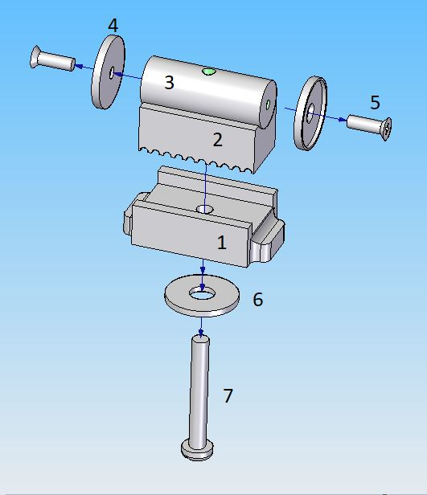

	    
Listing Parts
'''''''''''''

1. Base Belt Joint

  - Quantity : 1x
  - Material : 3D printed PLA (innerfill = 100%)

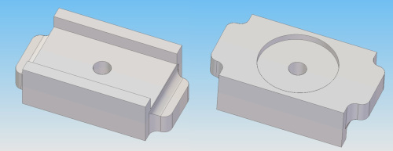

2. Counterpart Base Belt Joint 

  - Quantity : 1x
  - Material : 3D printed PLA (innerfill = 100%)

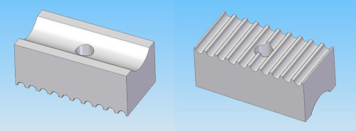

3. Spacer Metal Disc

  - Quantity : 1x
  - Material : Aluminium

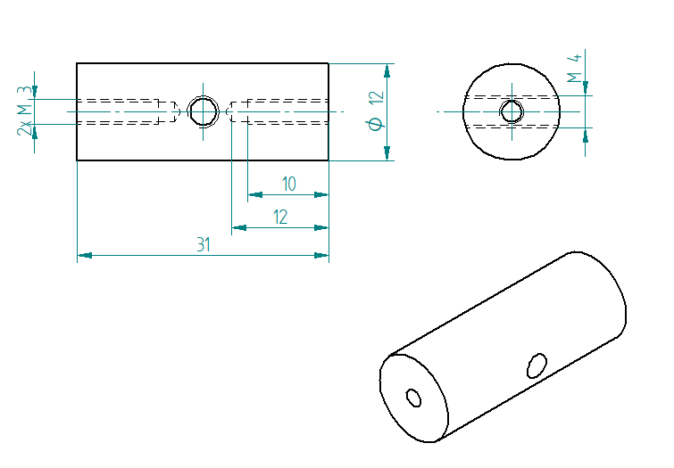
	    
4. Metal Disc

  - Quantity : 2x
  - Type : MSD-17
  - Inner diameter 17 mm, as a counterpart to magnets, not a magnet!  

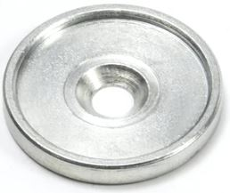

5. Phillips Head Screw M3 x 10

  - Quantity : 2x
  - Material : steel (should be magnetic)

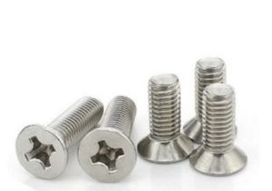

6. Washer M6 x 6.4 x 18 x 1.6

  - Quantity : 1x
  - Material : steel

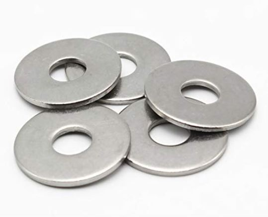
       
7. Screw Pan Head Slot M4 x 40

  - Quantity : 1x
  - Material : steel

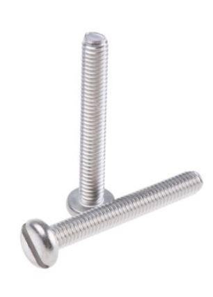

Static Parts
------------

Listing Parts
^^^^^^^^^^^^^
Square Bushing	    
''''''''''''''
Quantity : 2x

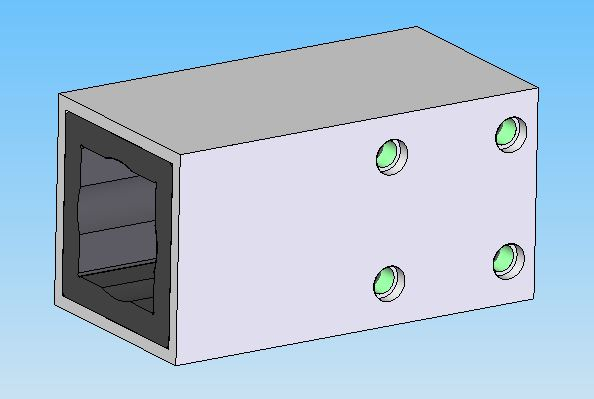
	    
Square Bushing
^^^^^^^^^^^^^^

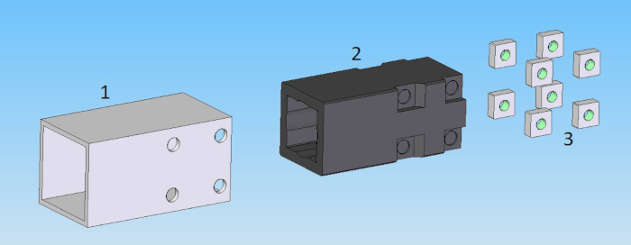

	    
