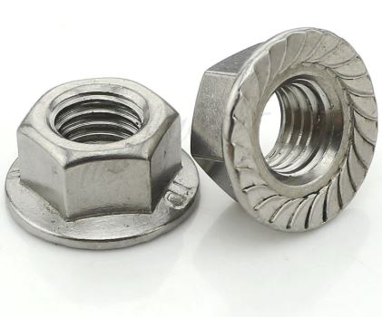

=======
Machine
=======

.. image:: figures/Machine-DIY-LM42P.JPG
    :width: 500
    :align: center
	    
Moving Parts
^^^^^^^^^^^^
Listing Parts
-------------
Motor
'''''
Quantity : 1x

Timing Pulley
'''''''''''''
Quantity : 1x

Timing Belt
'''''''''''
Quantity : 1x

Idler Pulley Long Screw
'''''''''''''''''''''''
Quantity : 2x

.. image:: figures/Idler_Pulley_Long_Screw-Machine-DIY-LM42P.JPG
    :width: 400
    :align: center

Idler Pulley Short Screw
''''''''''''''''''''''''
Quantity : 2x

.. image:: figures/Idler_Pulley_Short_Screw-Machine-DIY-LM42P.JPG
    :width: 400
    :align: center

Belt Joint
''''''''''
Quantity : 1x

	    

Idler Pulley Long Screw
-----------------------

Listing Parts
'''''''''''''

- Nuts M8 Stop

  - Quantity : 2x
  - Material : stainless

- Screw M8
  
  - Quantity : 2x

Idler Pulley Short Screw
------------------------

Listing Parts
'''''''''''''    

Belt Joint
----------

	    
Listing Parts
'''''''''''''

1. Base Belt Joint

  - Quantity : 1x
  - Material : 3D printed PLA (innerfill = 100%)

.. image:: figures/Base_Belt_Joint-Machine-DIY-LM42P.JPG
    :width: 350
    :align: center

2. Counterpart Base Belt Joint 

  - Quantity : 1x
  - Material : 3D printed PLA (innerfill = 100%)

3. Spacer Metal Disc

  - Quantity : 1x
  - Material : Aluminium

	    
4. Metal Disc

  - Quantity : 2x
  - Type : MSD-17
  - Inner diameter 17 mm, as a counterpart to magnets, not a magnet!  

.. image:: figures/Metal_Disc-Machine-DIY-LM42P.JPG
    :width: 180
    :align: center

5. Phillips Head Screw M3 x 10

  - Quantity : 2x
  - Material : steel (should be magnetic)

Static Parts
^^^^^^^^^^^^
Listing Parts
'''''''''''''

	    
