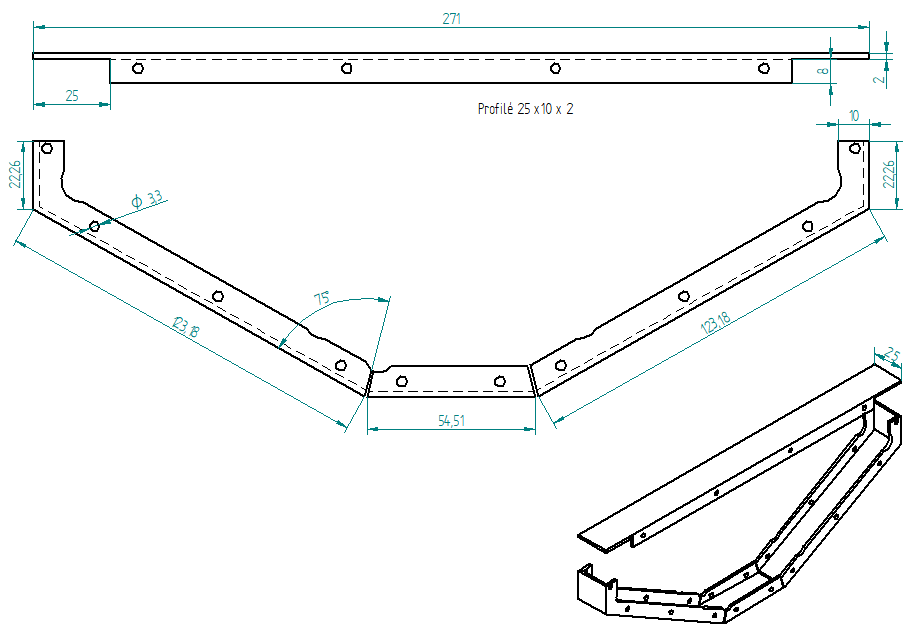
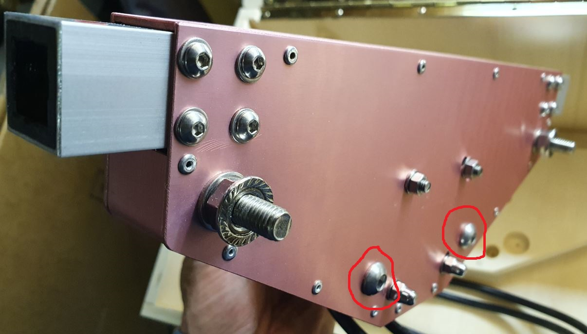

=======
Machine
=======

Static Parts
------------

Casing
^^^^^^

	    
Video
'''''
This video shows how to make the Casing and the Casing Motor Side

.. raw:: html

    <iframe width="350" height="245"
    src="https://www.youtube.com/embed/knJyQPlPn18"
    frameborder="0" 
    allowfullscreen></iframe>
    

Casing
''''''

Casing Motor Side
'''''''''''''''''

	    
Jig Casing
''''''''''

       
- STL file -> |JigCasingSTL|

.. |JigCasingSTL| raw:: html

  <a href="https://www.thingiverse.com/thing:4719536/files"
  target="_blank">Jig Casing STL</a>

- Drill Bush (to be hunted in jig) material : brass 

  .. image:: figures/DrillBush.PNG
      :width: 300
      :align: center	    
  
Frame
^^^^^

	    

Video
'''''

This video shows how to make the Frame :

.. raw:: html

    <iframe width="350" height="245"
    src="https://www.youtube.com/embed/J1oeEkLgkek"
    frameborder="0" 
    allowfullscreen></iframe>

    
Large Frame
'''''''''''

**Jig Drill Large Frame**

  .. image:: figures/Jig_Drill_Large_Frame-Pic-Machine-DIY-LM42P.JPG
       :width: 500
       :align: center	    	    

STL file -> |JigDrillLargeFrameSTL|

.. |JigDrillLargeFrameSTL| raw:: html

  <a href="https://www.thingiverse.com/thing:4722636/files"
  target="_blank">Jig Drill Large Frame STL</a>	       

  
Medium Frame
''''''''''''

**Jig Drill Medium Frame**

  .. image:: figures/Jig_Drill_Medium_Frame-Pic-Machine-DIY-LM42P.JPG
       :width: 500
       :align: center	    	    

STL file -> |JigDrillMediumFrameSTL|

.. |JigDrillMediumFrameSTL| raw:: html

  <a href="https://www.thingiverse.com/thing:4723118/files"
  target="_blank">Jig Drill Medium Frame STL</a>

**Jig Bend Medium Frame**

  .. image:: figures/Jig_Bend_Medium_Frame-Pic-Machine-DIY-LM42P.JPG
       :width: 500
       :align: center	    	    

STL file -> |JigBendMediumFrameSTL|

.. |JigBendMediumFrameSTL| raw:: html

  <a href="https://www.thingiverse.com/thing:4723155/files"
  target="_blank">Jig Bend Medium Frame STL</a>

**Angle Gauge Medium Frame**

  .. image:: figures/Angle_Gauge_Medium_Frame-Pic-Machine-DIY-LM42P.JPG
       :width: 500
       :align: center	    	    

STL file -> |AngleGaugeMediumFrameSTL|

.. |AngleGaugeMediumFrameSTL| raw:: html

  <a href="https://www.thingiverse.com/thing:4723181/files"
  target="_blank">Angle Gauge Medium Frame STL</a>    
  

Small Frame
'''''''''''

**Jig Drill Small Frame**

  .. image:: figures/Jig_Drill_Small_Frame-Pic-Machine-DIY-LM42P.JPG
       :width: 500
       :align: center	    	    

STL file -> |JigDrillSmallFrameSTL|

.. |JigDrillSmallFrameSTL| raw:: html

  <a href="https://www.thingiverse.com/thing:4723209/files"
  target="_blank">Jig Drill Small Frame STL</a>	       

	    
Bushing
^^^^^^^

Video
'''''

This video shows how to make the Bushing.

.. raw:: html

    <iframe width="350" height="245"
    src="https://www.youtube.com/embed/c_V-n5I3b1s"
    frameborder="0" 
    allowfullscreen></iframe>
    

Quantity : 2x

	    

	    
Bushing Sleeve
''''''''''''''

- Material : nylon
- STL file -> |BushingSleeveSTL|

.. |BushingSleeveSTL| raw:: html

    <a href="https://www.thingiverse.com/thing:4720838/files"
    target="_blank">Bushing Sleeve STL</a>

    
Bushing Shell
'''''''''''''

	    

	    
**Jig Drill Bushing Shell**

  .. image:: figures/Jig_Drill_Bushing_Shell-Pic-Machine-DIY-LM42P.JPG
       :width: 500
       :align: center	    	    

STL file -> |JigDrillBushingShellSTL|

.. |JigDrillBushingShellSTL| raw:: html

  <a href="https://www.thingiverse.com/thing:4723355/files"
  target="_blank">Jig Drill Bushing Shell STL</a>	       
	    

Spacer
^^^^^^

	    
This video shows how to make the Spacer.

.. raw:: html

    <iframe width="350" height="245"
    src="https://www.youtube.com/embed/c_V-n5I3b1s?start=267&end=314"
    frameborder="0" 
    allowfullscreen></iframe>	    

	 

	    
Moving Parts
------------

Listing Parts
^^^^^^^^^^^^^
Motor
'''''
Quantity : 1x

Timing Pulley
'''''''''''''
- Quantity : 1x
- Type : HTD3M Type 40T
- Size : hole diameter = 8mm width =  16mm

  .. |TimingPulleyAliexpress| raw:: html

    <a href="https://www.aliexpress.com/item/32816074465.html?spm=a2g0s.9042311.0.0.27424c4dc8WrRN"
    target="_blank">Aliexpress</a>
  
- Where to buy : |TimingPulleyAliexpress|

	    
Timing Belt
'''''''''''
Quantity : 1x

Idler Pulley Long Screw
'''''''''''''''''''''''
Quantity : 2x

.. image:: figures/Idler_Pulley_Long_Screw-Machine-DIY-LM42P.JPG
    :width: 400
    :align: center

Idler Pulley Short Screw
''''''''''''''''''''''''
Quantity : 2x

.. image:: figures/Idler_Pulley_Short_Screw-Machine-DIY-LM42P.JPG
    :width: 400
    :align: center

Belt Joint
''''''''''
Quantity : 1x

.. image:: figures/Belt_Joint-Machine-DIY-LM42P.JPG
    :width: 300
    :align: center

Rod
'''
Quantity : 1x or 2x

Idler Pulley Long Screw
^^^^^^^^^^^^^^^^^^^^^^^

Listing Parts
'''''''''''''

1) Long Screw M8
  
  - Quantity : 1x
  - Length : 50mm  
  - Material : stainless
        
  .. image:: figures/Long_Screw-Machine-DIY-LM42P.JPG
    :width: 250
    :align: center
	    
2) Washer 8 x 12 x 1.5

  - Quantity : 4x
  - Material : aluminium
    
  .. image:: figures/Washer_8x12x1_5-Machine-DIY-LM42P.PNG
    :width: 300
    :align: center

.. note::
   
   Maybe better to use 1x Stainless steel Flat Washer Thickness 1mm 
   (8x14x1mm) and 1x Stainless steel Flat Washer 0.5mm
   (8x14x0.5). 1.5mm doesn't exist. Because aluminum tends to crush
   when it's squeezed.
   
3) Flange Ball Bearing

  - Quantity : 2x
  - Type : F698ZZ
  - Size : 8 x 19 x 6 mm
    
  .. image:: figures/Flange_Ball_Bearing-Machine-DIY-LM42P.JPG
    :width: 300
    :align: center

4) Flat Washer

  - Quantity : 2x
  - Thickness : 0.5mm
  - Size : 8 x 12 x 0.5 mm
  - Material : stainless  
    
  .. image:: figures/Flat_Washer-Machine-DIY-LM42P.JPG
    :width: 300
    :align: center   
   
5) Bearing

   - Quantity : 1x
   - Type : 698ZZ
   - Size : 8 x 19 x 6 mm  

  .. image:: figures/Bearing-Machine-DIY-LM42P.JPG
    :width: 200
    :align: center

6) Washer M6

   - Quantity : 1x
   - Material : stainless  
   - Size : 8 x 16 x 1.6 mm  

  .. image:: figures/Washer_M8-Machine-DIY-LM42P.JPG
    :width: 200
    :align: center	    
	    
7) Nuts M8 Stop

  - Quantity : 1x
  - Material : stainless

  .. image:: figures/Nuts_M8_Stop-Machine-DIY-LM42P.JPG
    :width: 180
    :align: center
	    

Idler Pulley Short Screw
^^^^^^^^^^^^^^^^^^^^^^^^

  .. image:: figures/Idler_Pulley_Short_Screw_Exploded-Machine-DIY-LM42P.JPG
    :width: 500
    :align: center

Listing Parts
'''''''''''''

1) Short Screw M8
  
  - Quantity : 1x
  - Length : 35mm
  - Material : stainless

  .. image:: figures/Short_Screw_M8-Machine-DIY-LM42P.JPG
    :width: 250
    :align: center  
    
2) Washer 8 x 12 x 1.5

  - Quantity : 4x
  - Material : aluminium
    
  .. image:: figures/Washer_8x12x1_5-Machine-DIY-LM42P.PNG
    :width: 300
    :align: center

.. note::
   
   Maybe better to use 1x Stainless steel Flat Washer Thickness 1mm 
   (8x14x1mm) and 1x Stainless steel Flat Washer 0.5mm
   (8x14x0.5). Because aluminum tends to crush when it's squeezed. 

3) Flange Ball Bearing

  - Quantity : 2x
  - Type : F698ZZ
  - Size : 8 x 19 x 6 mm
    
  .. image:: figures/Flange_Ball_Bearing-Machine-DIY-LM42P.JPG
    :width: 300
    :align: center

4) Flat Washer

  - Quantity : 2x
  - Thickness : 0.5mm
  - Size : 8 x 12 x 0.5 mm
  - Material : stainless  
    
  .. image:: figures/Flat_Washer-Machine-DIY-LM42P.JPG
    :width: 300
    :align: center   
   
5) Bearing

   - Quantity : 1x
   - Type : 698ZZ
   - Size : 8 x 19 x 6 mm  

  .. image:: figures/Bearing-Machine-DIY-LM42P.JPG
    :width: 200
    :align: center

6) Washer M8

   - Quantity : 1x
   - Material : stainless  
   - Size : 8 x 16 x 1.6 mm  

  .. image:: figures/Washer_M8-Machine-DIY-LM42P.JPG
    :width: 200
    :align: center	    	    

7) Cap Nuts M8

   - Quantity : 1x
   - Material : stainless  

  .. image:: figures/Cap_Nuts_M8-Machine-DIY_LM42P.JPG
    :width: 200
    :align: center	    
	    

Belt Joint
^^^^^^^^^^

Video
'''''

This video shows how to make the Belt Joint

.. raw:: html

    <iframe width="350" height="245"
    src="https://www.youtube.com/embed/40f_kVVAy8c"
    frameborder="0" 
    allowfullscreen></iframe>
    
	    
Listing Parts
'''''''''''''

.. image:: figures/Belt_Joint_Exploded-Machine-DIY-LM42P.JPG
    :width: 400
    :align: center

1. Base Belt Joint
   
   .. image:: figures/Base_Belt_Joint-Machine-DIY-LM42P.JPG
    :width: 350
    :align: center
	    
  - Quantity : 1x
  - Material : 3D printed PLA (innerfill = 100%)
  - STL file -> |BaseBeltJointSTL|

  .. |BaseBeltJointSTL| raw:: html

    <a href="https://www.thingiverse.com/thing:4718335/files"
    target="_blank">Base Belt Joint STL</a>

2. Counterpart Base Belt Joint 

   .. image:: figures/Counterpart_Base_Belt_Joint-Machine-DIY-LM42P.JPG
    :width: 350
    :align: center
   
  - Quantity : 1x
  - Material : 3D printed PLA (innerfill = 100%)
  - STL file -> |ConterPartBaseBeltJointSTL|

  .. |ConterPartBaseBeltJointSTL| raw:: html

    <a href="https://www.thingiverse.com/thing:4714825/files"
    target="_blank">Counterpart Base Belt Joint STL</a>

3. Spacer Metal Disc

  - Quantity : 1x
  - Material : Aluminium

.. image:: figures/Spacer_Metal_Disc.PNG
    :width: 450
    :align: center	    
	    
4. Metal Disc

  - Quantity : 2x
  - Type : MSD-17
  - Inner diameter 17 mm, as a counterpart to magnets, not a magnet!  

.. image:: figures/Metal_Disc-Machine-DIY-LM42P.JPG
    :width: 180
    :align: center

5. Phillips Head Screw M3 x 10

  - Quantity : 2x
  - Material : steel (should be magnetic)

.. image:: figures/Phillips_Head_Screw_M3x10.JPG
    :width: 180
    :align: center

6. Washer M6 x 6.4 x 18 x 1.6

  - Quantity : 1x
  - Material : steel

       
7. Screw Pan Head Slot M4 x 40

  - Quantity : 1x
  - Material : steel

Rod
^^^

Video
'''''

This video shows how to make the Rod

.. raw:: html

    <iframe width="350" height="245"
    src="https://www.youtube.com/embed/hlsWKp7FWDQ"
    frameborder="0" 
    allowfullscreen></iframe>

    
Listing Parts
'''''''''''''

#. Scare Tube 15 x 15 x 249
   
   .. image:: figures/Square_Tube_15_15_249-Machine-DIY-LM42P.PNG
    :width: 500
    :align: center
	    
#. Insert M4 x 12
#. Magnet

   .. image:: figures/Magnet-Rod-DIY-LM42P.JPG
      :width: 200
      :align: center

   Pot magnet with threaded stud diam. 16mm Thread M4 strength
   approx. 8kg

   - Quantity : 1x
   - Type : GTN-16

   .. |PotMagnetSupermagnete| raw:: html

     <a href="https://www.supermagnete.ch/eng/pot-magnets-with-threaded-stud/pot-magnet-with-threaded-stud-16mm_GTN-16"
     target="_blank">supermagnete.ch</a>
  
   - Where to buy : |PotMagnetSupermagnete|

   .. note::
      It's important to buy at supermagnete because I bought some in
      Aliexpress but the strength is lower than those bought at supermagnete
  

#. Spacer 25 / M6

   
Manufacturing Process
'''''''''''''''''''''

#. Cut the Square Tube 15 x 15 x 249 at length = 249mm
#. Make the the Insert M4 x 12
   

Assembly
--------

Video
^^^^^

.. raw:: html

    <iframe width="350" height="245"
    src="https://www.youtube.com/embed/k691ffIHoc0?start=0&end=1542"
    frameborder="0" 
    allowfullscreen></iframe>

There is an error occured in this video the bolts (in red) should be
mounted like on these images : 

    
    
.. image:: figures/Machine-DIY-LM42P.JPG
    :width: 500
    :align: center

Listing Parts
'''''''''''''
- Rivets

  - Quantity : 28
  - Supplier : Debrunner
  
  .. image:: figures/RivetPop_2.JPG
    :width: 150
    :align: center
	    
  .. image:: figures/RivetPop.png
    :width: 500
    :align: center
	    
	    

	    

	    
