Electrical Part
===============

Electrical Box
--------------

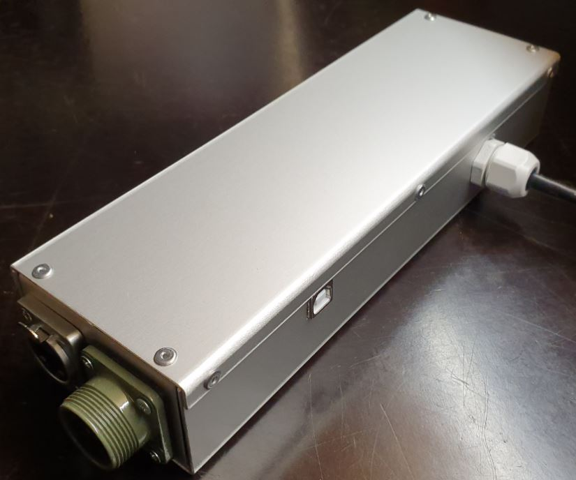

Parts
^^^^^

U Base
''''''

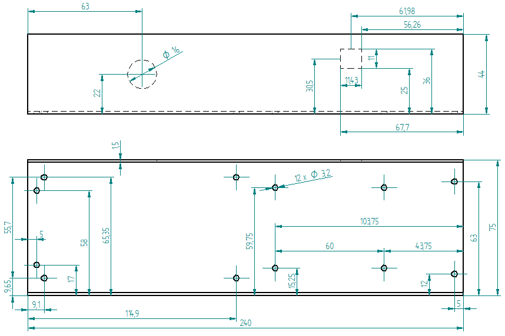

U Top
'''''

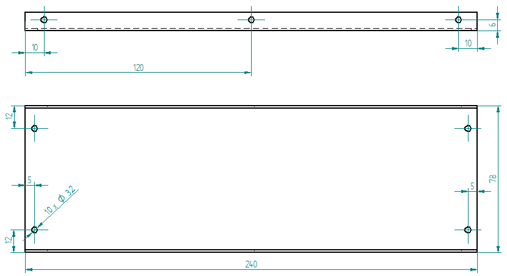

U Right
'''''''

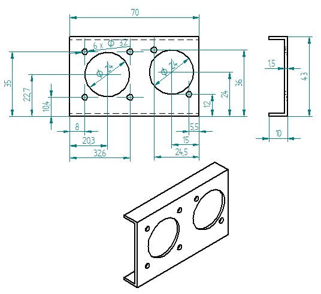

U Left
''''''

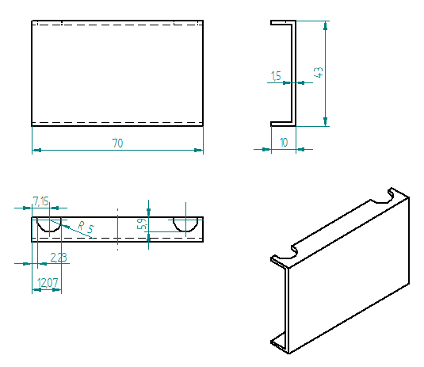

Spacer 6mm
''''''''''

.. image:: figures/Entretoise8_6-LM42P.PNG
    :scale: 70 %
    :align: center

	    
Square-10_12_9
''''''''''''''

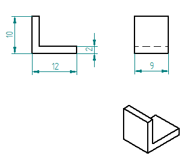

	    
Countersunk Head Screw M3 x 8mm
''''''''''''''''''''''''''''''''

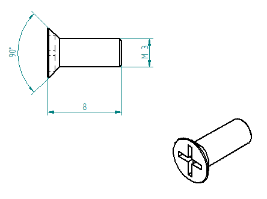
	    
To fix Geckodrive on the U Base

	    
Countersunk Head Screw M3 x 12mm
''''''''''''''''''''''''''''''''

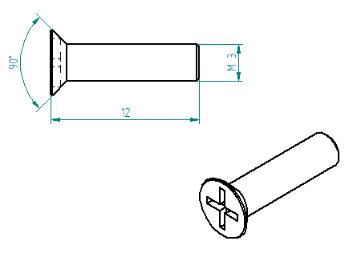
	    
To fix the Amphenol Plug on the U Right

Countersunk Head Screw M3 x 14mm
''''''''''''''''''''''''''''''''

To fix the Power 36V also the Ground Terminal on the U Base

.. image:: figures/Countersunk-Head-Screw-M3x14mm-LM42P-DIY.PNG
    :scale: 70 %
    :align: center

	    
Geckodrive G201X
''''''''''''''''

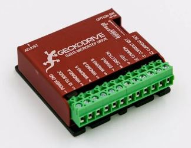

Power 36V
'''''''''

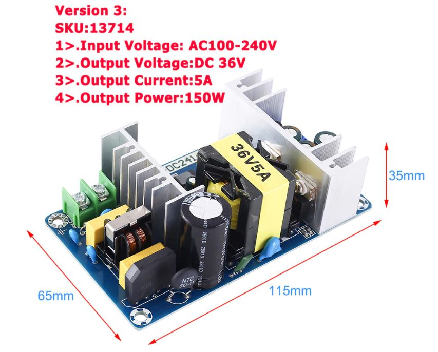

Capacitor
'''''''''

This reduce the noise while reading the speed on the remote-control 

Scrape the surface on the U Base
^^^^^^^^^^^^^^^^^^^^^^^^^^^^^^^^

To ensure good contact with the ground

See Video :

.. raw:: html

    <iframe width="350" height="196.875"
    src="https://www.youtube.com/embed/RGeVY6nWUIQ?start=152&end=173"
    frameborder="0" 
    allowfullscreen></iframe>

Control Power 36V 
^^^^^^^^^^^^^^^^^
Control the voltage of the output of the Power 36V with a voltmeter. It
should be 36V.

Adjust voltage Power 36/12V
^^^^^^^^^^^^^^^^^^^^^^^^^^^

Materials:
''''''''''

* 1 wire 0.5mm^2 red length = 12cm
* 1 wire 0.5mm^2 red length = 15cm
* 1 wire 0.5mm^2 black length = 14cm
* 1 wire 0.5mm^2 black length = 6cm

Sold the wire
'''''''''''''
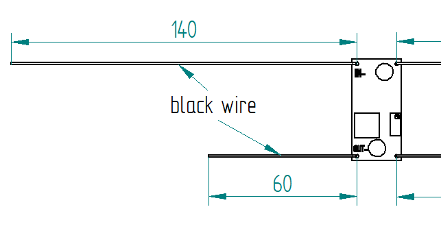

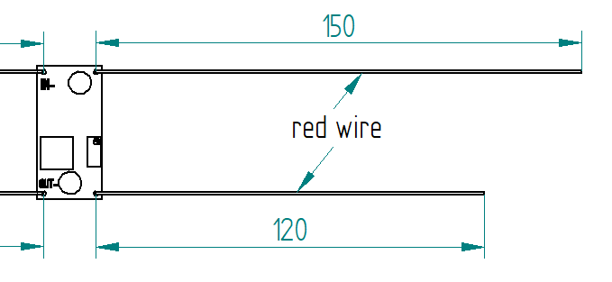

Wire the Power 36/12V
'''''''''''''''''''''

1) Connect the Power 36/12V IN  to the Power 36V OUT
2) Connect the voltmeter to Power 36/12V OUT

Adjust the voltage
''''''''''''''''''
With a *Screwdriver 0*, adjust the voltage to 12V
   
   
Fix the Power Cable to the Electrical Box
^^^^^^^^^^^^^^^^^^^^^^^^^^^^^^^^^^^^^^^^^

See Video :

.. raw:: html

    <iframe width="350" height="196.875"
    src="https://www.youtube.com/embed/RGeVY6nWUIQ?start=1355&end=1581"
    frameborder="0" 
    allowfullscreen></iframe>

1) Strip the *Power Cable* at 10cm
2) Fix the *Cable Gland* to the *Electrical Box*
3) Tighten *Cable Gland*
4) Tighten the *Flange* and cut it with the *Cutting Pliers*
5) Tighten the *Terminal* on the ground wire
6) Tighten the Phase and Neutre to *Power 36V IN*

Set Geckodrive current limit
^^^^^^^^^^^^^^^^^^^^^^^^^^^^

- For G203V :

  Connect a resistor of 120kOhms between pin 11 and 12 of the 
  GECKODRIVE. This will limit MOTOR current by 5A.

- For G201X :

  set the switches like the following figure

  .. image:: figures/Switch-5A-G201X.png
  	:scale: 70 %
 	:align: center
		
   
Fix the Power 36V and Geckodrive on the U Base
^^^^^^^^^^^^^^^^^^^^^^^^^^^^^^^^^^^^^^^^^^^^^^

Use threadlocker glue.

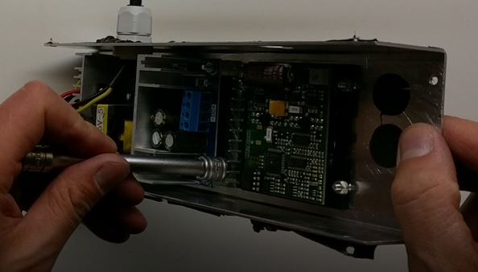

- For Power 36V :
  
  Use the Spacer 6mm, Countersunk Head Screw M3 x 12mm, washer and
  nuts  

  Fix the ground to the U Base

  =========  ===================    
  Power 36V  Aluminium Box
  =========  ===================
  GROUND     screw with *Spacer*
  =========  ===================

  .. image:: figures/Power36V-Ground.jpg
  	:scale: 50 %
 	:align: center
		
- For Geckodrive :

  Use Countersunk Head Screw M3 x 8mm, washer and nuts 

Glue the Power 36/12V and Arduino
^^^^^^^^^^^^^^^^^^^^^^^^^^^^^^^^^

Glue the Arduino at the U base with silicone Polyflex 444 and
Square-10_12_9 
 
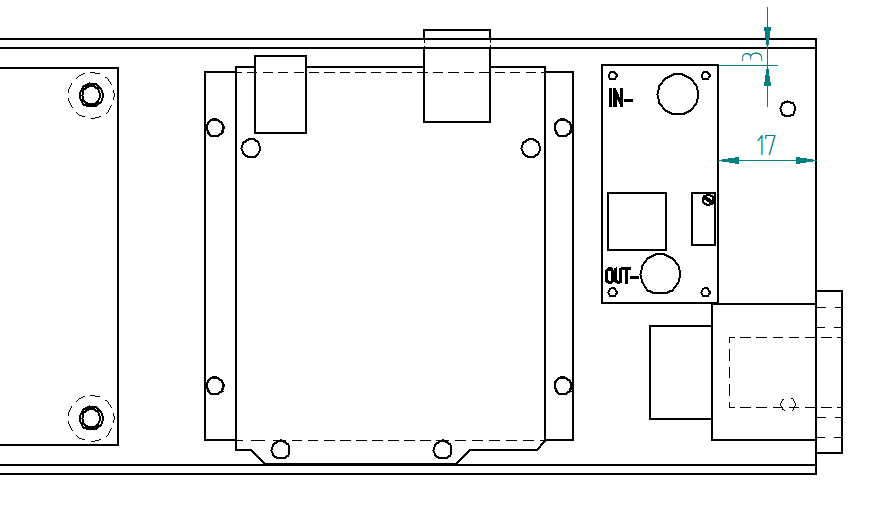

.. image:: figures/Glue-Power36V-12V-Arduino.jpg
    :scale: 70 %
    :align: center 	    

Wiring
^^^^^^

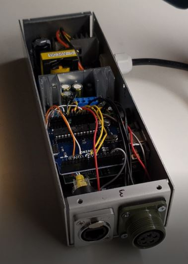

See video :

.. raw:: html

    <iframe width="350" height="196.875"
    src="https://www.youtube.com/embed/RGeVY6nWUIQ?start=1581&end=1806"  
    frameborder="0" 
    allowfullscreen></iframe>

    
1) Connect the wires to the "Barrette" except the POWER 36/12V OUT+

   Use two clamps this help to sold the "Barrette"

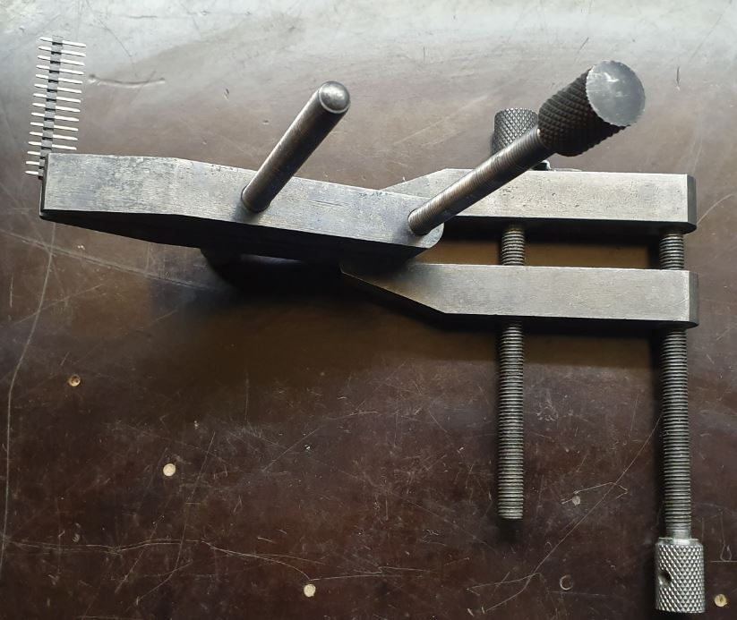
   
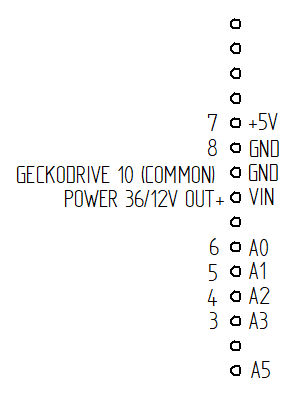

	    
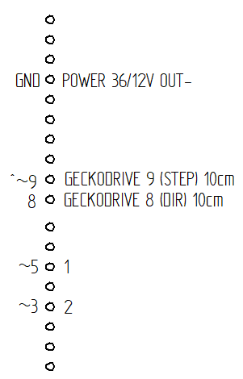

===========  =======  ============
GECKODRIVE   ARDUINO  Cable Lenght
===========  =======  ============
8 (DIR)      PIN 8    11cm
9 (STEP)     PIN 9    11cm
10 (COMMON)  GND       7cm
===========  =======  ============

============  =======  ============
POWER 36/12V  ARDUINO  Cable Length
============  =======  ============
OUT-          GND      6cm
OUT+          VIN      12cm
============  =======  ============

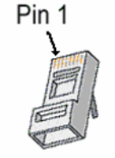

============  =======================  ============
ARDUINO       RJ45 cable (inside Box)  Cable Length
============  =======================  ============
A0            6 sold capacitor +       12cm     
A1            5                          "
A2            4                          "
A3            3                          "
\~3           2                        15cm 
~5            1                          " 
GND           8 sold capacitor -       12cm
\+5V          7                          "
============  =======================  ============

2) Sold the Capacitor between A0 and GND (8) see folowing picture

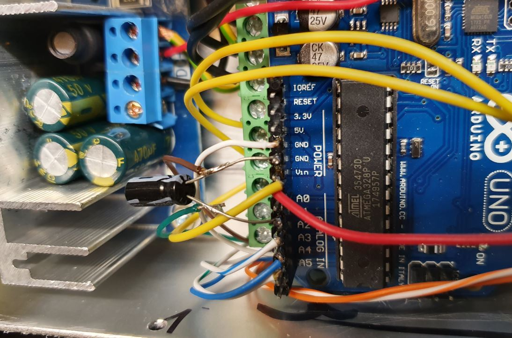

3) Connect :

=========  ================  ============
Power 36V     GECKODRIVE     Cable Length
=========  ================  ============
\-DC       1 (POWER GND)     6cm
D+         2 (18 TO 80 VDC)   "
=========  ================  ============

=========  ============  ============
Power 36V  POWER 36/12V  Cable Length            
=========  ============  ============
\-DC       IN-           14cm
DC+        IN+           15cm
=========  ============  ============

=================  ========================  ============
GECKODRIVE         Female Connector (MOTOR)  Cable Length
=================  ========================  ============
3 (WINDING A)      A                         15cm
4 (WINDING not A)  B                          "
5 (WINDING B)      C                          "
6 (WINDING not B)  D                          "
=================  ========================  ============

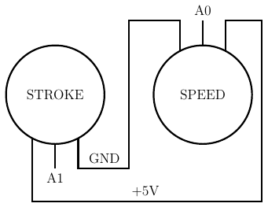

==============  ============================
Remote-Control   RJ45 cable (Remote-Control)
==============  ============================
A0              6
A1              5
GND             8
\+5V            7
==============  ============================

Connect the Amphenol Plug Male
------------------------------

1. strip the cable at 3cm
2. strip the 4 wires and solder the wires
3. 5cm from the edge roll up the 10-layer adhesive tape
4. pass the cable and solder the wires in the plug in
   counter-clockwise order 
   
   * black
   * yellow
   * red
   * green

   .. image:: figures/Wires-Plug.png
    :scale: 120 %
    :align: center
	    
5. assemble the plug and tighten the flange

Wiring the Remote Control
-------------------------

1. strip the cable at 7cm
2. cut the unused wire
3. use the cutted unused wire to make the bridge between GRD and +5V
   inside the Remote Control

   
Connect and fix the 4 poles cable on the stepper motor
======================================================

1. déballage et contrôle du moteur
2. couper le cable en silicone à 2.2m
3. couper le fil rouge à 47mm; couper le fil jaune à 57mm; couper le
   fil bleu à 67mm, couper le fil vert à 77mm see following picture

   .. image:: figures/Cut-Motor-Cable.jpg
	   
4. dénuder, torsader, étamer les fils du moteur à 5mm
5. couper la gaine thermo à 37mm de longueur et la serrer avec foehn
   industriel. Le fil rouge doit dépasser d'environ 5mm (pour les 4
   fils)
6. dénuder le cable en silicone à 45mm
7. couper sur le cable en silicone le fil rouge à 40mm; le fil jaune à
   30mm; le fil noir à 20mm; le fil vert à 10mm.
8. dénuder, torsader, étamer les fils du câble à 5mm
9. couper gaine thermo à 13mm (pour passer 1es fils)
10. mettre gaine thermo 13mm + tube (Attention au chanfrein) et souder
11. dégraisser tube, câble et moteur à l'acétone; mettre la vis M5 NE
    PAS OUBLIER!; injecter le Polyflex par le trou diam. 4.5mm 
   jusqu'à ce que ça sorte des deux cotés du tube; prendre le
   surplus et l'appliquer sur le moteur sur la rainure où la vis M5 a
   été placée; tourner le tube à ce que le trou d'injection soit
   contre le moteur et ne soit voit pas; mettre une bride sur le
   cable, plaquer le tube avec le clamp see following picture;
   
   .. image:: figures/Fix-Motor-Cable.jpg
	   
   injecter si besoin à l'extrémiter du tube où il y a le chanfrein et
   mettre un peu de Polyflex vert le moteur si l'on voit les fils qui
   dépassent un peu de la gaine thermo
12. laisser durcir; nettoyer et enlever les bourelets sur tube cordon 

	    
