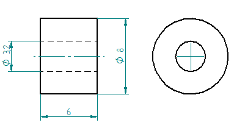

Electrical Part
===============

Electrical Box
--------------

Parts
^^^^^

Spacer
''''''

Inside the electrical box
^^^^^^^^^^^^^^^^^^^^^^^^^

.. image:: figures/Boitier-Electrique-Ouvert.jpg
    :scale: 70 %
    :align: center

Components
^^^^^^^^^^
=========    ========  ===========  
Picture      Quantity  Description  
=========    ========  ===========  
|photo_1|    screw M3  asf
afdfd        scew M3   wer
=========    ========  ===========

.. |photo_1| replace:: bonjour

Control Power 36V 
^^^^^^^^^^^^^^^^^^
Control the voltage of the output of the Power 36V with a voltmeter. It
should be 36V.

Adjust voltage Power 36/12V
^^^^^^^^^^^^^^^^^^^^^^^^^^^

Materials:
''''''''''

* 1 wire 0.5mm^2 red length = 12cm
* 1 wire 0.5mm^2 red length = 15cm
* 1 wire 0.5mm^2 black length = 14cm
* 1 wire 0.5mm^2 black length = 6cm

Sold the wire
'''''''''''''
.. image:: figures/Power36_12V-Black-Wired-LM42P.PNG
    :scale: 70 %
    :align: center

Wire the Power 36/12V
'''''''''''''''''''''

1) Connect the Power 36/12V IN  to the Power 36V OUT
2) Connect the voltmeter to Power 36/12V OUT
3) With a *Screwdriver 0*, adjust the voltage to 12V
   
Fix the Power Cable to the Electrical Box
^^^^^^^^^^^^^^^^^^^^^^^^^^^^^^^^^^^^^^^^^

See Video Here

1) Strip the *Power Cable* at 10cm
2) Fix the *Cable Gland* to the *Electrical Box*
3) Tighten *Cable Gland*
4) Tighten the *Flange* and cut it with the *Cutting Pliers*
5) Tighten the *Terminal* on the ground wire

   
Fix the Power 36V
^^^^^^^^^^^^^^^^^

Wiring
^^^^^^

=========  ================
Power 36V     GECKODRIVE
=========  ================
\-DC       1 (POWER GND)
D+         2 (18 TO 80 VDC)
=========  ================

=========  ========================
Power 36V  Female Connector (MOTOR)              
=========  ========================
GROUND     ?E?
=========  ========================

=========  ============  ============
Power 36V  POWER 36/12V  Cable Lenght            
=========  ============  ============
\-DC       IN-           14cm
DC+        IN+           15cm
=========  ============  ============

=========  =============    
Power 36V  Aluminium Box
=========  =============
GROUND     screw
=========  =============

=================  ========================
GECKODRIVE         Female Connector (MOTOR)
=================  ========================
3 (WINDING A)      A
4 (WINDING not A)  B
5 (WINDING B)      C
6 (WINDING not B)  D
=================  ========================

===========  =======  ============
GECKODRIVE   ARDUINO  Cable Lenght
===========  =======  ============
8 (DIR)      PIN 8    10cm
9 (STEP)     PIN 9    10cm
10 (COMMON)  GND
===========  =======  ============

Connect a resistor of 120kOhms between pin 11 and 12 of the 
GECKODRIVE. This will limit MOTOR current by 5A.

============  =======  ============
POWER 36/12V  ARDUINO  Cable Lenght
============  =======  ============
OUT-          GND      6cm
OUT+          VIN      12cm
============  =======  ============

.. image:: figures/RJ45-Show-Pin1.png
	:scale: 70 %
	:align: center

============  =======================
ARDUINO       RJ45 cable (inside Box)
============  =======================
A0            6
A1            5
A2            4
A3            3
\~3           2
~5            1
GND           8
\+5V          7
============  =======================

.. image:: figures/Remote-Control-Wiring.png
   :scale: 70 %
   :align: center

==============  ============================
Remote-Control   RJ45 cable (Remote-Control)
==============  ============================
A0              6
A1              5
GND             8
\+5V            7
==============  ============================

	    
.. image:: figures/Schema-Cablage-Tableau.jpg
    :scale: 70 %
    :align: center

	    

	    
