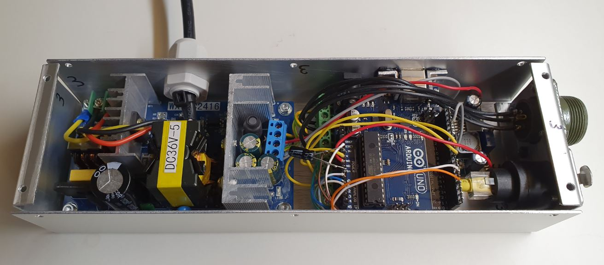

Electrical Part
===============

Electrical Box
--------------

Parts
^^^^^

U Base
''''''

U Top
'''''

U Right
'''''''

U Left
''''''

.. image:: figures/U-Left-LM42P-DIY.PNG
    :scale: 70 %
    :align: center

Spacer 6mm
''''''''''

.. image:: figures/Entretoise8_6-LM42P.PNG
    :scale: 70 %
    :align: center

	    
Square-10_12_9
''''''''''''''

.. image:: figures/Square-10_12_9-LM42P-DIY.PNG
    :scale: 70 %
    :align: center

Countersunk Head Screw M3 x 8mm
''''''''''''''''''''''''''''''''

pris 10mm mais idéalement 8mm pour Geckodrive

	    
Countersunk Head Screw M3 x 12mm
''''''''''''''''''''''''''''''''

.. image:: figures/Countersunk-Head-Screw-M3x12mm-LM42P-DIY.PNG
    :scale: 70 %
    :align: center

	    
Countersunk Head Screw M3 x 16mm
''''''''''''''''''''''''''''''''

14mm pas 16mm

.. image:: figures/Countersunk-Head-Screw-M3x16mm-LM42P-DIY.PNG
    :scale: 70 %
    :align: center

	    
Countersunk Head Screw M3 x 14mm
''''''''''''''''''''''''''''''''

pris 16mm mais idéalement 14mm pour la fixation de la cosse (terre)
sur l'alimentation.
	    

Geckodrive G201X
''''''''''''''''

Power 36V
'''''''''

.. image:: figures/Power36V.jpg
    :scale: 50 %
    :align: center	    

       
Components
^^^^^^^^^^
=========    ========  ===========  
Picture      Quantity  Description  
=========    ========  ===========  
|photo_1|    screw M3  asf
afdfd        scew M3   wer
=========    ========  ===========

.. |photo_1| replace:: bonjour
		       

Control Power 36V 
^^^^^^^^^^^^^^^^^^
Control the voltage of the output of the Power 36V with a voltmeter. It
should be 36V.

Adjust voltage Power 36/12V
^^^^^^^^^^^^^^^^^^^^^^^^^^^

Materials:
''''''''''

* 1 wire 0.5mm^2 red length = 12cm
* 1 wire 0.5mm^2 red length = 15cm
* 1 wire 0.5mm^2 black length = 14cm
* 1 wire 0.5mm^2 black length = 6cm

Sold the wire
'''''''''''''
.. image:: figures/Power36_12V-Black-Wired-LM42P.PNG
    :scale: 70 %
    :align: center

.. image:: figures/Power36_12V-Red-Wired-LM42P.PNG
    :scale: 70 %
    :align: center

Wire the Power 36/12V
'''''''''''''''''''''

1) Connect the Power 36/12V IN  to the Power 36V OUT
2) Connect the voltmeter to Power 36/12V OUT

Adjust the voltage
''''''''''''''''''
With a *Screwdriver 0*, adjust the voltage to 12V
   
   
Fix the Power Cable to the Electrical Box
^^^^^^^^^^^^^^^^^^^^^^^^^^^^^^^^^^^^^^^^^

See Video :

.. raw:: html

    <iframe width="560" height="315"
    src="https://www.youtube.com/embed/RGeVY6nWUIQ?start=1355&end=1581"
    frameborder="0" 
    allowfullscreen></iframe>

1) Strip the *Power Cable* at 10cm
2) Fix the *Cable Gland* to the *Electrical Box*
3) Tighten *Cable Gland*
4) Tighten the *Flange* and cut it with the *Cutting Pliers*
5) Tighten the *Terminal* on the ground wire
6) Tighten the Phase and Neutre to *Power 36V IN*

Set Geckodrive current limit at 5A :
^^^^^^^^^^^^^^^^^^^^^^^^^^^^^^^^^^^^

- For G203V :

  Connect a resistor of 120kOhms between pin 11 and 12 of the 
  GECKODRIVE. This will limit MOTOR current by 5A.

- For G201X :

  set the switches like the following figure

  .. image:: figures/Switch-5A-G201X.png
  	:scale: 70 %
 	:align: center
		
   
Fix the Power 36V and Geckodrive on the U Base
^^^^^^^^^^^^^^^^^^^^^^^^^^^^^^^^^^^^^^^^^^^^^^

.. image:: figures/Fix-Power36V-Gecko.jpg
  	:scale: 70 %
 	:align: center

- For Power 36V :
  
  Use the Spacer 6mm, Countersunk Head Screw M3 x 12mm, washer and nut 

  Fix the ground to the U Base

  =========  ===================    
  Power 36V  Aluminium Box
  =========  ===================
  GROUND     screw with *Spacer*
  =========  ===================

  .. image:: figures/Power36V-Ground.jpg
  	:scale: 70 %
 	:align: center
		
- For Geckodrive :

  Use Countersunk Head Screw M3 x 8mm 

Glue the Power 36/12V and Arduino
^^^^^^^^^^^^^^^^^^^^^^^^^^^^^^^^^

.. image:: figures/Glue-Power36V-12V-Arduino.jpg
    :scale: 70 %
    :align: center 	    

Wiring
^^^^^^

See video :

.. raw:: html

    <iframe width="560" height="315"
    src="https://www.youtube.com/embed/RGeVY6nWUIQ?start=1581&end=1806"  
    frameborder="0" 
    allowfullscreen></iframe>

    
1) Connect the wires to the "Barrette" except the POWER 36/12V OUT+

   .. image:: figures/Barette-Pin-Left.PNG
    :scale: 70 %
    :align: center

	    
   .. image:: figures/Barette-Pin-Right.PNG
    :scale: 70 %
    :align: center	    

   ===========  =======  ============
   GECKODRIVE   ARDUINO  Cable Lenght
   ===========  =======  ============
   8 (DIR)      PIN 8    11cm
   9 (STEP)     PIN 9    11cm
   10 (COMMON)  GND       7cm
   ===========  =======  ============

   ============  =======  ============
   POWER 36/12V  ARDUINO  Cable Length
   ============  =======  ============
   OUT-          GND      6cm
   OUT+          VIN      12cm
   ============  =======  ============

   .. image:: figures/RJ45-Show-Pin1.png
	:scale: 70 %
	:align: center

   ============  =======================  ============
   ARDUINO       RJ45 cable (inside Box)  Cable Length
   ============  =======================  ============
   A0            6 sold capacitor +       12cm     
   A1            5                          "
   A2            4                          "
   A3            3                          "
   \~3           2                        15cm 
   ~5            1                          " 
   GND           8 sold capacitor -       12cm
   \+5V          7                          "
   ============  =======================  ============

2) Sold the Capacitor between A0 and GND (8) see folowing picture

3) Connect :

=========  ================  ============
Power 36V     GECKODRIVE     Cable Length
=========  ================  ============
\-DC       1 (POWER GND)     6cm
D+         2 (18 TO 80 VDC)   "
=========  ================  ============

=========  ============  ============
Power 36V  POWER 36/12V  Cable Length            
=========  ============  ============
\-DC       IN-           14cm
DC+        IN+           15cm
=========  ============  ============

=================  ========================  ============
GECKODRIVE         Female Connector (MOTOR)  Cable Length
=================  ========================  ============
3 (WINDING A)      A                         15cm
4 (WINDING not A)  B                          "
5 (WINDING B)      C                          "
6 (WINDING not B)  D                          "
=================  ========================  ============

==============  ============================
Remote-Control   RJ45 cable (Remote-Control)
==============  ============================
A0              6
A1              5
GND             8
\+5V            7
==============  ============================

	    

Connect the Amphenol Plug Male
------------------------------

1. strip the cable at 3cm
2. strip the 4 wires and solder the wires
3. 5cm from the edge roll up the 10-layer adhesive tape
4. pass the cable and solder the wires in the plug in
   counter-clockwise order 
   
   * black
   * yellow
   * red
   * green

   .. image:: figures/Wires-Plug.png
    :scale: 100 %
    :align: center
5. assemble the plug and tighten the flange

Wiring the Remote Control
-------------------------

1. strip the cable at 7cm
2. cut the unused wire
3. use the cutted unused wire to make the bridge between GRD and +5V
   inside the Remote Control

	    
