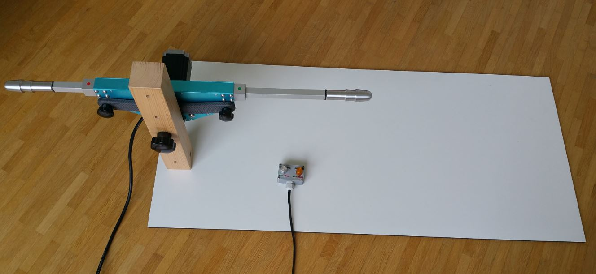

.. lm42p-diy documentation master file, created by
   sphinx-quickstart on Thu Oct 31 19:51:53 2019.
   You can adapt this file completely to your liking, but it should at least
   contain the root `toctree` directive.

Welcome to lm42p-diy's documentation!
=====================================

.. toctree::
   :maxdepth: 2
   :caption: Contents:

   ElectricalPart/ElectricalPart
   FasteningElements/FasteningElements
   Donate
   Contact

Indices and tables
==================

* :ref:`genindex`
* :ref:`modindex`
* :ref:`search`
